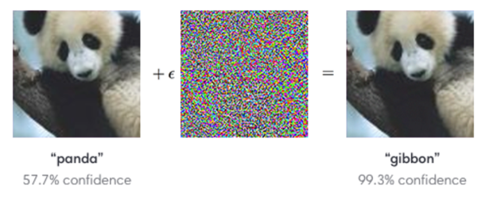

# Adversarial Noise Attack
## Introduction
Adversarial Noise Attack is a Python package that allows users to manipulate images by adding adversarial noise. 
The purpose of this noise is to trick an image classification model into misclassifying the altered image as a specified 
target class, regardless of the original content. This library provides an easy-to-use interface for generating adversarial 
images that can be used for testing the robustness of image classification models.



## Installation
Requirements: Python3

```
pip install -r requirements.txt
```

## Usage
In order to generate an adversarial image, you will need to provide an input image and a target class name. The target class name
should be a valid class label from the model's output space.

```shell
python src/generator.py <input_file_name> <target_class_name>
```

For example:
```shell
python src/generator.py data/sample_images/bird.jpg airliner
```

#### NOTES:
- Three hyperparameters have been arbitrarily set in the `generator.py` script. These are the `learning_rate`, `max_iterations`, and `epsilon`. 
  - `learning_rate` - This parameter controls the step size of the gradient descent algorithm. A smaller learning rate will result in a more precise but slower optimization process.
  - `max_iterations` - This parameter determines the maximum number of iterations that the optimization algorithm will run for. A higher value will allow the algorithm to explore the solution space more thoroughly.
  - `epsilon` - This parameter controls the magnitude of the adversarial noise. A larger epsilon value will result in a more noticeable change to the image, but may also make the adversarial example easier to detect.
- Sometimes, the target category is not reached because the loss function is not minimized enough. In this case, you can try to increase the `max_iterations`. I have set the default value to 500 and I seem to find that it works well for most cases.

### Future improvement
- Expand the model availability to include other pre-trained models.
- Document when and why an attack may fail.
